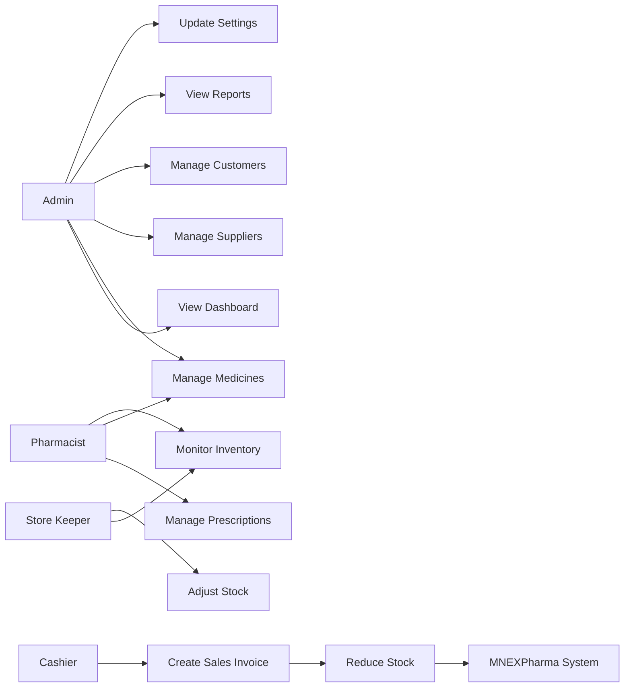
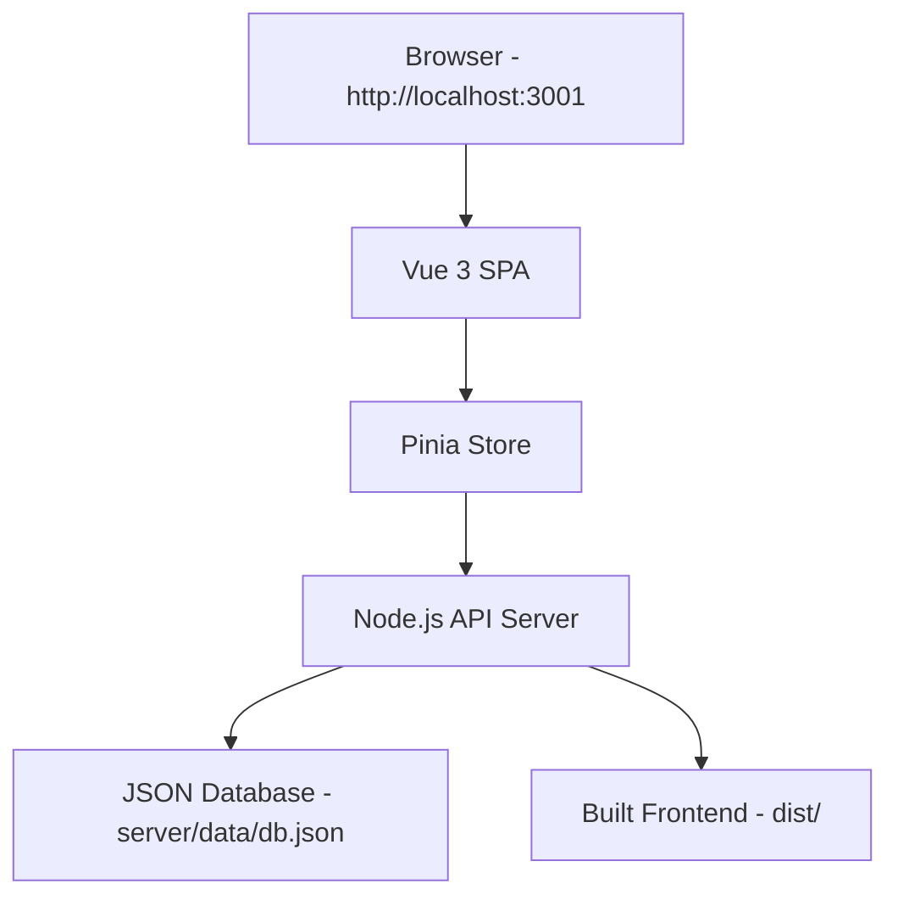
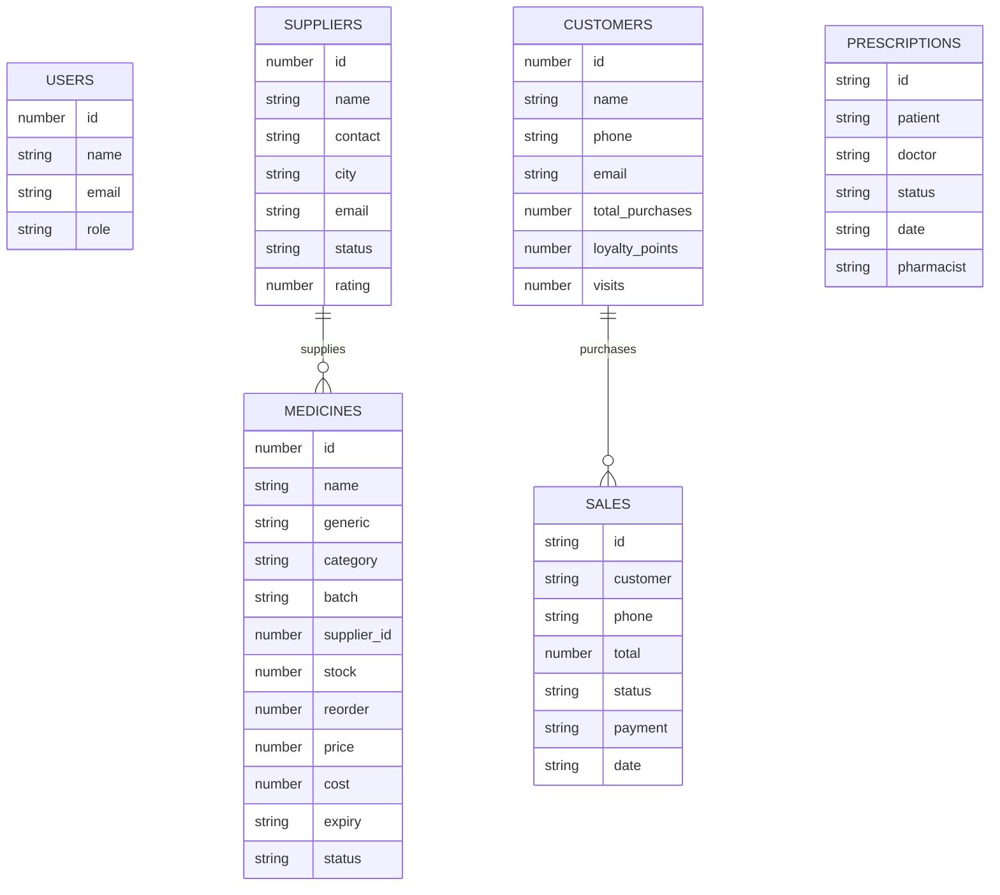

# MNEXPharma - Pharmacy Management System

## Project Documentation

**Course Title:** Project on Web Development  
**Course Code:** SWE-382  
**Department:** Software Engineering  
**Student:** Mufazzal Hasan Khan Midad  
**Student ID:** 232-134-030  
**Batch:** 5th  
**Project Type:** Full-stack web application  
**Submission Date:** 23-06-2026  

---

## Table of Contents

1. [Introduction](#1-introduction)
2. [System Analysis and Requirements](#2-system-analysis-and-requirements)
3. [System Design](#3-system-design)
4. [Technology Stack and Environment Setup](#4-technology-stack-and-environment-setup)
5. [Implementation](#5-implementation)
6. [Testing](#6-testing)
7. [Results and Screenshots](#7-results-and-screenshots)
8. [Limitations and Future Work](#8-limitations-and-future-work)
9. [Conclusion](#9-conclusion)
10. [References and Appendices](#10-references-and-appendices)

---

## 1. Introduction

### 1.1 Background

Pharmacies handle medicine records, customer information, supplier relationships, prescriptions, billing, stock levels, and business reports every day. In many small or medium pharmacies, these tasks are still managed through notebooks, spreadsheets, or disconnected software. This creates repeated manual work and increases the chance of mistakes in stock counting, expiry tracking, and sales calculation.

MNEXPharma was developed as a web-based pharmacy management system to centralize these operations in one dashboard. The system helps pharmacy staff manage medicine inventory, process sales, track prescriptions, monitor suppliers, and view useful business reports from a single interface.

The project is designed as a full-stack academic demonstration. The frontend is built with Vue.js 3, Vite, Tailwind CSS, and Pinia. The backend is built with Node.js using a local JSON database for persistence. The application can be opened from one local full-stack link, where the backend also serves the built frontend.

### 1.2 Problem Statement

Manual pharmacy management is time-consuming and error-prone. Staff may forget to reorder low-stock medicines, miss expired items, calculate sales incorrectly, or lose customer and supplier records. A pharmacy needs a structured system that can manage medicines, billing, prescriptions, inventory, suppliers, customers, employees, notifications, and reports together. MNEXPharma addresses this problem by providing a centralized full-stack web application for pharmacy operations.

### 1.3 Objectives

**Main objective:**  
Build a web-based pharmacy management system that allows pharmacy staff to manage medicines, inventory, sales, prescriptions, suppliers, customers, employees, notifications, and reports using a Vue.js frontend and a backend API.

**Specific objectives:**

- Implement a dashboard with sales, stock, expiry, supplier, and revenue summaries.
- Provide CRUD operations for medicines, suppliers, and customers.
- Implement a POS workflow that creates sales invoices and reduces medicine stock.
- Track inventory status, low-stock items, expired medicines, and stock adjustments.
- Manage prescriptions through pending, verified, and dispensed workflow stages.
- Provide backend API endpoints consumed by the Vue frontend.
- Store data persistently in a local JSON database for academic testing.
- Serve frontend and backend together from one local full-stack URL.

### 1.4 Scope and Limitations

**Scope:**

- Medicine catalog management.
- Inventory monitoring and stock adjustment.
- Sales POS and invoice creation.
- Supplier and customer management.
- Prescription tracking.
- Doctor and employee listing.
- Notification read status.
- Reports and analytics.
- Settings update.
- Demo authentication.
- Full-stack local deployment using one link.

**Limitations:**

- The backend uses a JSON file database instead of MySQL.
- Authentication is demo-level and does not use secure password hashing.
- Role permissions are represented in the UI but not enforced with production-grade middleware.
- Barcode scanning, real-time synchronization, cloud deployment, mobile app support, and multi-branch management are future enhancements.
- The project is suitable for academic demonstration, not direct production use without further hardening.

### 1.5 Document Organization

Chapter 2 describes the system analysis and requirements. Chapter 3 explains system architecture, data design, API design, and frontend structure. Chapter 4 lists the technology stack and setup process. Chapter 5 describes the implementation of backend and frontend modules. Chapter 6 presents testing. Chapter 7 summarizes results and screenshots. Chapter 8 states limitations and future work. Chapter 9 concludes the project. Chapter 10 lists references and appendices.

---

## 2. System Analysis and Requirements

### 2.1 Existing System Study

The existing manual approach depends on paper records or spreadsheets. Medicine stock may be counted manually, sales may be recorded in notebooks, and supplier dues may be tracked separately. These methods are difficult to search, update, and audit. Expiry dates and low-stock levels are also easy to miss when information is not centralized.

MNEXPharma replaces this scattered workflow with one web-based dashboard. It stores pharmacy records in a structured backend data file and exposes them through API endpoints. The frontend consumes those endpoints and displays module-specific views for each pharmacy operation.

### 2.2 Requirement Gathering Method

Requirements were gathered from the course assignment plan, pharmacy management use cases, and analysis of common pharmacy workflows. The requirement guideline and assignment document identified the core modules: dashboard, medicines, inventory, sales POS, purchases, suppliers, customers, prescriptions, doctors, reports, employees, notifications, users and roles, and settings.

### 2.3 Functional Requirements

| ID | Requirement | User Role |
|---|---|---|
| FR-01 | Log in using demo credentials | Admin |
| FR-02 | View dashboard summary cards and charts | Admin, Staff |
| FR-03 | View, create, update, and delete medicines | Admin, Pharmacist |
| FR-04 | Monitor stock levels and expiry status | Admin, Pharmacist |
| FR-05 | Adjust medicine stock quantity | Admin, Store Keeper |
| FR-06 | Create sales invoices through POS | Cashier, Pharmacist |
| FR-07 | Automatically reduce stock after a sale | System |
| FR-08 | View, create, update, and delete suppliers | Admin |
| FR-09 | View, create, update, and delete customers | Admin, Staff |
| FR-10 | Upload and manage prescriptions | Pharmacist |
| FR-11 | Change prescription status from pending to verified or dispensed | Pharmacist |
| FR-12 | View doctors and employees | Admin, Staff |
| FR-13 | View purchase orders and purchase summary | Admin |
| FR-14 | View reports and analytics | Admin |
| FR-15 | Mark notifications as read | Admin, Staff |
| FR-16 | Update pharmacy settings | Admin |
| FR-17 | Run frontend and backend from one local URL | Developer, Evaluator |

### 2.4 Non-Functional Requirements

| Category | Requirement |
|---|---|
| Usability | The interface should be clear and understandable for pharmacy staff. |
| Performance | Pages should load quickly on a local development machine. |
| Maintainability | Code should be divided into components, stores, services, and backend modules. |
| Reliability | Data should persist locally after refresh through the JSON database. |
| Portability | The project should run locally with Node.js and npm commands. |
| Scalability | The backend API structure should allow future migration to Laravel/MySQL. |
| Security | Demo auth is available, but production security is listed as future work. |

### 2.5 Use Case Diagram



The admin manages the main system records and settings. Pharmacists handle medicines, inventory, and prescriptions. Cashiers create bills through POS. Store keepers update stock quantities. The system automatically calculates summaries and updates stock after sales.

---

## 3. System Design

### 3.1 System Architecture

MNEXPharma follows a single-page application architecture with an API backend. Vue.js renders the frontend and uses Pinia for shared state. The backend is a Node.js HTTP server that exposes REST-style API endpoints. Data is stored in `server/data/db.json`. In full-stack mode, the same backend server also serves the built frontend from the `dist/` folder.



### 3.2 Entity Relationship Diagram



The supplier-to-medicine relationship is represented by `supplier_id` in medicine records. Sales are linked to customers through customer name and phone in this academic version. Prescriptions contain patient and doctor information directly for simple demonstration.

### 3.3 Database Schema

The project uses JSON collections instead of SQL tables. Each collection behaves like a table in the local data file.

#### users

| Field | Type | Constraint | Description |
|---|---|---|---|
| id | number | Unique | User identifier |
| name | string | Required | Full user name |
| email | string | Required | Login email |
| role | string | Required | User role |
| avatar | string/null | Optional | Profile avatar |

#### medicines

| Field | Type | Constraint | Description |
|---|---|---|---|
| id | number | Unique | Medicine identifier |
| name | string | Required | Medicine name |
| generic | string | Required | Generic name |
| category | string | Required | Therapeutic category |
| manufacturer | string | Optional | Manufacturer name |
| batch | string | Required | Batch number |
| dosage_form | string | Optional | Tablet, capsule, syrup, etc. |
| strength | string | Optional | Medicine strength |
| supplier_id | number | References suppliers.id | Supplier identifier |
| stock | number | Required | Current stock |
| reorder | number | Required | Reorder level |
| price | number | Required | Selling price |
| cost | number | Required | Purchase cost |
| expiry | string | Required | Expiry date |
| status | string | Required | active or expired |
| description | string | Optional | Medicine details |

#### suppliers

| Field | Type | Constraint | Description |
|---|---|---|---|
| id | number | Unique | Supplier identifier |
| name | string | Required | Supplier company name |
| contact | string | Required | Phone number |
| city | string | Optional | Supplier city |
| email | string | Optional | Supplier email |
| status | string | Required | active or inactive |
| rating | number | Optional | Supplier rating |

#### sales

| Field | Type | Constraint | Description |
|---|---|---|---|
| id | string | Unique | Invoice number |
| customer | string | Required | Customer name |
| phone | string | Optional | Customer phone |
| items | array/number | Required | Sold items or item count |
| amount | number | Required | Subtotal |
| discount | number | Optional | Discount amount |
| vat | number | Optional | VAT amount |
| total | number | Required | Final total |
| payment | string | Required | Payment method |
| status | string | Required | paid, pending, refunded |
| date | string | Required | Sale date |
| time | string | Optional | Sale time |

#### customers

| Field | Type | Constraint | Description |
|---|---|---|---|
| id | number | Unique | Customer identifier |
| name | string | Required | Customer name |
| phone | string | Required | Phone number |
| email | string | Optional | Email address |
| address | string | Optional | Address |
| total_purchases | number | Default 0 | Total purchase value |
| loyalty_points | number | Default 0 | Loyalty points |
| visits | number | Default 0 | Visit count |
| last_visit | string | Optional | Last visit date |
| status | string | Required | active or inactive |
| type | string | Required | new or returning |

#### prescriptions

| Field | Type | Constraint | Description |
|---|---|---|---|
| id | string | Unique | Prescription identifier |
| patient | string | Required | Patient name |
| patient_phone | string | Optional | Patient phone |
| doctor | string | Required | Doctor name |
| doctor_specialty | string | Optional | Specialty |
| date | string | Required | Prescription date |
| status | string | Required | pending, verified, dispensed |
| medicines | array | Optional | Prescribed medicines |
| notes | string | Optional | Doctor notes |
| pharmacist | string/null | Optional | Assigned pharmacist |

### 3.4 API Design

| Method | Endpoint | Description | Auth Required |
|---|---|---|---|
| GET | `/api/health` | Check backend status | No |
| POST | `/api/auth/login` | Demo login and token issue | No |
| POST | `/api/auth/logout` | Demo logout | No |
| GET | `/api/dashboard` | Dashboard stats, recent sales, low-stock and expired items | No |
| GET | `/api/medicines` | List medicines | No |
| POST | `/api/medicines` | Create medicine | No |
| PATCH | `/api/medicines/{id}` | Update medicine | No |
| DELETE | `/api/medicines/{id}` | Delete medicine | No |
| POST | `/api/medicines/{id}/adjust-stock` | Adjust stock | No |
| GET | `/api/suppliers` | List suppliers | No |
| POST | `/api/suppliers` | Create supplier | No |
| PATCH | `/api/suppliers/{id}` | Update supplier | No |
| DELETE | `/api/suppliers/{id}` | Delete supplier | No |
| GET | `/api/customers` | List customers | No |
| POST | `/api/customers` | Create customer | No |
| PATCH | `/api/customers/{id}` | Update customer | No |
| DELETE | `/api/customers/{id}` | Delete customer | No |
| GET | `/api/sales` | List sales | No |
| POST | `/api/sales` | Create sale and reduce stock | No |
| GET | `/api/prescriptions` | List prescriptions | No |
| POST | `/api/prescriptions` | Create prescription | No |
| PATCH | `/api/prescriptions/{id}` | Update prescription status | No |
| GET | `/api/doctors` | List doctors | No |
| GET | `/api/employees` | List employees | No |
| GET | `/api/purchases-summary` | Purchase summary and orders | No |
| GET | `/api/reports` | Monthly sales, category, customer and inventory reports | No |
| GET | `/api/settings` | Get settings | No |
| PATCH | `/api/settings` | Update settings | No |
| GET | `/api/notifications` | List notifications | No |
| POST | `/api/notifications/{id}/read` | Mark notification as read | No |

### 3.5 Frontend Component Structure

```text
src/
  App.vue
  main.js
  router/
    index.js
  stores/
    authStore.js
    pharmacyStore.js
  services/
    api.js
  components/
    common/
      BaseButton.vue
      BaseCard.vue
      BaseInput.vue
      BaseModal.vue
      BaseTable.vue
    layout/
      AppLayout.vue
      AppNavbar.vue
      AppSidebar.vue
    dashboard/
      SalesChart.vue
      RevenueChart.vue
      RecentSales.vue
      LowStockTable.vue
      ExpiredMedicineTable.vue
  pages/
    Dashboard.vue
    SalesPOS.vue
    Medicines.vue
    Inventory.vue
    Purchases.vue
    Suppliers.vue
    Customers.vue
    Prescriptions.vue
    Reports.vue
    Doctors.vue
    Employees.vue
    Notifications.vue
    UsersRoles.vue
    Settings.vue
```

### 3.6 Wireframes / UI Mockups

The final UI uses a sidebar dashboard layout. The most important screens are:

- Dashboard: summary cards, charts, low-stock table, expired medicine table, and recent sales.
- Medicines: searchable catalog with filters and add/edit/delete modal forms.
- Sales POS: medicine catalog, shopping cart, billing calculation, and invoice view.
- Reports: revenue charts, category chart, sales report, and inventory summary.

Screenshots are included in the repository under the `Screenshot/` folder when available.

---

## 4. Technology Stack and Environment Setup

### 4.1 Technology Stack

| Layer | Technology | Purpose |
|---|---|---|
| Frontend Framework | Vue.js 3 | Reactive single-page application |
| Build Tool | Vite 5 | Build, dev server, and asset bundling |
| Styling | Tailwind CSS 3 | Dashboard UI design |
| State Management | Pinia | Shared frontend state |
| Routing | Vue Router 4 | Page navigation |
| Charts | Chart.js and vue-chartjs | Dashboard and report visualizations |
| Icons | Heroicons Vue | Interface icons |
| Backend Runtime | Node.js | API server and full-stack static serving |
| Backend Storage | JSON file | Local academic persistence |
| API Communication | Fetch API | Frontend-to-backend HTTP requests |

### 4.2 Development Environment

| Item | Value |
|---|---|
| Operating System | Windows |
| Runtime | Node.js |
| Package Manager | npm |
| Local Full-stack URL | `http://localhost:3001` |
| API Base URL | `/api` |
| Database File | `server/data/db.json` |

### 4.3 Installation Steps

Run the following commands from a clean clone:

```bash
git clone https://github.com/MidadKhaNz/-mnexpharma.git
cd -mnexpharma
npm install
npm run seed
npm run fullstack
```

Open the project:

```text
http://localhost:3001
```

Useful commands:

```bash
npm run seed       # reset demo database
npm run dev        # frontend dev server only
npm run api        # backend API only
npm run build      # build frontend
npm run fullstack  # build frontend and serve frontend + API from one link
```

On Windows PowerShell, `npm.ps1` may be blocked by execution policy. In that case, use:

```bash
npm.cmd run seed
npm.cmd run fullstack
```

### 4.4 Environment Variables

This project does not require a `.env` file for local academic use. Optional values:

```text
PORT=3001
API_PORT=3001
VITE_API_URL=/api
```

---

## 5. Implementation

### 5.1 Backend Implementation

The backend is implemented in `server/index.js`. It uses Node.js built-in `http`, `fs`, and `url` modules. The backend does not require Express, Laravel, or an external database server. This keeps the project simple to run for academic evaluation.

Major backend modules:

- Authentication: `POST /api/auth/login` returns a demo token and admin user.
- Dashboard: `GET /api/dashboard` calculates revenue, low-stock, expired, supplier, and recent sales data.
- Medicines: generic CRUD routes manage medicine catalog records.
- Sales POS: `POST /api/sales` validates stock, creates an invoice, reduces medicine stock, and updates customer purchase totals when possible.
- Inventory: medicine update and stock adjustment persist to the JSON database.
- Suppliers: CRUD routes return supplier records with purchase and due metrics.
- Customers: CRUD routes persist customer records.
- Prescriptions: CRUD routes support upload and status workflow.
- Reports: `GET /api/reports` calculates monthly sales, revenue, category distribution, top customers, sales report, and inventory report.
- Settings: `GET/PATCH /api/settings` reads and updates pharmacy preferences.
- Static serving: non-API routes serve the Vue app from `dist/`, allowing one full-stack link.

Example sale creation logic:

```js
async function createSale(req, res) {
  const db = await readDatabase()
  const body = await readBody(req)
  const items = Array.isArray(body.items) ? body.items : []

  for (const item of items) {
    const medicine = findById(db.medicines, item.medicine_id)
    if (!medicine) return send(res, 422, { error: 'Medicine was not found.' })
    if (Number(medicine.stock) < Number(item.qty || 0)) {
      return send(res, 422, { error: `${medicine.name} does not have enough stock.` })
    }
  }

  items.forEach((item) => {
    const medicine = findById(db.medicines, item.medicine_id)
    medicine.stock = Math.max(0, Number(medicine.stock) - Number(item.qty || 0))
  })
}
```

### 5.2 Frontend Implementation

The frontend is organized under `src/`. Vue Router controls page navigation. Pinia stores shared state in `authStore.js` and `pharmacyStore.js`. API requests are centralized in `src/services/api.js`.

The `pharmacyStore.js` file loads data from the backend for medicines, suppliers, customers, sales, prescriptions, doctors, employees, purchases, reports, settings, and notifications. The store also provides actions such as `addMedicine`, `updateMedicine`, `deleteMedicine`, `addSale`, `saveCustomer`, `saveSupplier`, `savePrescription`, `updatePrescriptionStatus`, and `saveSettings`.

Example API service:

```js
const API_BASE_URL = import.meta.env.VITE_API_URL || '/api'

async function request(path, options = {}) {
  const response = await fetch(`${API_BASE_URL}${path}`, {
    headers: { 'Content-Type': 'application/json' },
    ...options,
  })
  const payload = await response.json()
  if (!response.ok) throw new Error(payload.error || 'API request failed')
  return payload.data ?? payload
}
```

### 5.3 Authentication Flow

The login flow is demo-based:

1. The frontend sends email and password to `POST /api/auth/login`.
2. The backend validates the email if provided.
3. The backend returns a random token and admin user object.
4. The auth store saves the token and user in memory.
5. The user can view the dashboard and modules.

Demo login:

```text
Email: admin@mnexpharma.com
Password: any value
```

### 5.4 Notable Challenges and Solutions

| Challenge | Cause | Solution |
|---|---|---|
| Frontend and backend had separate links | Vite served frontend on port 5173 and API on port 3001 | Backend was updated to serve the built Vue app from `dist/`, giving one link: `http://localhost:3001`. |
| Port 3001 already in use | Previous backend process was still running | Used Windows process tools to stop the old process before restarting. |
| Mock-only frontend data | Original app loaded most modules from `mockData.js` | Added a backend API, central API service, and Pinia actions for all core modules. |
| Academic guideline expected Laravel/MySQL | The current project did not include a Laravel backend | Documented the actual working stack honestly and listed Laravel/MySQL as future migration. |

---

## 6. Testing

### 6.1 Testing Approach

Testing was primarily manual and command-based. The project was tested by running the build process, seeding the database, starting the full-stack server, opening the UI, and checking backend endpoints through HTTP requests. No automated unit test framework is currently included.

### 6.2 Test Cases

| Test ID | Description | Input | Expected Result | Status |
|---|---|---|---|---|
| TC-01 | Seed database | `npm.cmd run seed` | Database file is recreated with demo data | Pass |
| TC-02 | Build frontend | `npm.cmd run build` | `dist/` folder is generated successfully | Pass |
| TC-03 | Start full-stack app | `npm.cmd run fullstack` | App runs on `http://localhost:3001` | Pass |
| TC-04 | Open dashboard | `/` | Dashboard loads from single full-stack link | Pass |
| TC-05 | Health API | `GET /api/health` | Returns backend status | Pass |
| TC-06 | Dashboard API | `GET /api/dashboard` | Returns stats and report data | Pass |
| TC-07 | Medicine list | `GET /api/medicines` | Returns medicine records | Pass |
| TC-08 | Supplier list | `GET /api/suppliers` | Returns supplier records | Pass |
| TC-09 | Customer CRUD | POST/PATCH/DELETE customer | Customer is created, updated, and deleted | Pass |
| TC-10 | Prescription status | PATCH prescription status | Status changes to verified or dispensed | Pass |
| TC-11 | Settings update | PATCH `/api/settings` | Settings are saved | Pass |
| TC-12 | Direct route refresh | `/notifications` | Vue page loads through backend server | Pass |

### 6.3 Bug Tracking

| Bug | Resolution |
|---|---|
| `EADDRINUSE` on port 3001 | The existing server process was already running. The solution was to stop the old process or simply open the already running app. |
| Frontend-only mock data | Replaced static page-level data with API-backed Pinia state. |
| Separate frontend and backend links | Added frontend static serving to the backend server. |
| PowerShell blocked `npm.ps1` | Used `npm.cmd` commands on Windows. |

---

## 7. Results and Screenshots

The completed project runs as a one-link full-stack application:

```text
http://localhost:3001
```

Expected working pages:

- Dashboard: shows sales, revenue, stock, supplier, and notification summaries.
- Medicines: supports medicine add, edit, delete, search, and filtering.
- Inventory: shows stock status, expiry status, and stock adjustment.
- Sales POS: supports cart, billing, payment method, invoice, and stock deduction.
- Suppliers: supports supplier CRUD.
- Customers: supports customer CRUD.
- Prescriptions: supports upload and status workflow.
- Reports: shows sales and inventory analytics.
- Settings: saves pharmacy preferences.
- Notifications: supports read and read-all behavior.

Screenshots may be added from the running system under `Screenshot/` or included in a final PDF report.

---

## 8. Limitations and Future Work

### 8.1 Limitations

- Authentication is for demonstration only.
- The project does not yet hash passwords or enforce protected API routes.
- Data is stored in JSON rather than a relational database.
- There is no automated test suite.
- File upload for prescriptions stores metadata only in this academic version.
- Some advanced admin features such as strict role permissions are not fully enforced.

### 8.2 Future Work

- Migrate backend to Laravel.
- Replace JSON storage with MySQL.
- Add secure authentication with Laravel Sanctum or JWT.
- Add role-based middleware and route protection.
- Add barcode scanner support.
- Add multi-branch pharmacy management.
- Add real-time inventory synchronization.
- Add cloud deployment.
- Add automated PDF report generation.
- Add automated tests.
- Build a mobile or PWA version.

---

## 9. Conclusion

MNEXPharma successfully implements the core modules of a pharmacy management system for academic demonstration. The project includes a Vue.js dashboard frontend, backend API, persistent local data storage, medicine management, inventory tracking, POS billing, prescription workflow, customer and supplier management, reports, notifications, and settings.

The main objective of building a web-based pharmacy management system has been achieved. The project also demonstrates how a frontend SPA can communicate with backend API endpoints and how a full-stack application can be served from one local link. The work can be improved further by migrating the backend to Laravel/MySQL, adding secure authentication, and implementing production-level deployment and testing.

---

## 10. References and Appendices

### 10.1 References

- Vue.js Documentation. Available at: https://vuejs.org/guide/
- Vite Documentation. Available at: https://vitejs.dev/
- Pinia Documentation. Available at: https://pinia.vuejs.org/
- Vue Router Documentation. Available at: https://router.vuejs.org/
- Tailwind CSS Documentation. Available at: https://tailwindcss.com/docs
- Chart.js Documentation. Available at: https://www.chartjs.org/docs/
- Node.js Documentation. Available at: https://nodejs.org/docs
- Heroicons Documentation. Available at: https://heroicons.com/

### 10.2 Appendices

#### Appendix A: Important Project Files

| File | Purpose |
|---|---|
| `server/index.js` | Backend API and full-stack static server |
| `server/database.js` | JSON database seeding and read/write utilities |
| `server/seed.js` | Resets the demo database |
| `src/services/api.js` | Frontend API request wrapper |
| `src/stores/pharmacyStore.js` | Main Pinia store for pharmacy modules |
| `src/stores/authStore.js` | Demo auth store |
| `vite.config.js` | Vite config and API proxy for development |
| `package.json` | Scripts and dependencies |

#### Appendix B: One-Link Run Command

```bash
npm.cmd run seed
npm.cmd run fullstack
```

Then open:

```text
http://localhost:3001
```
